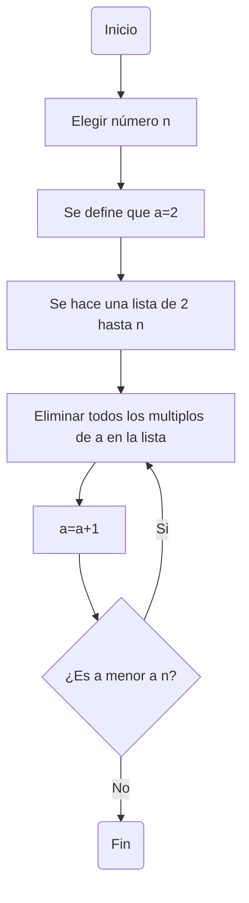
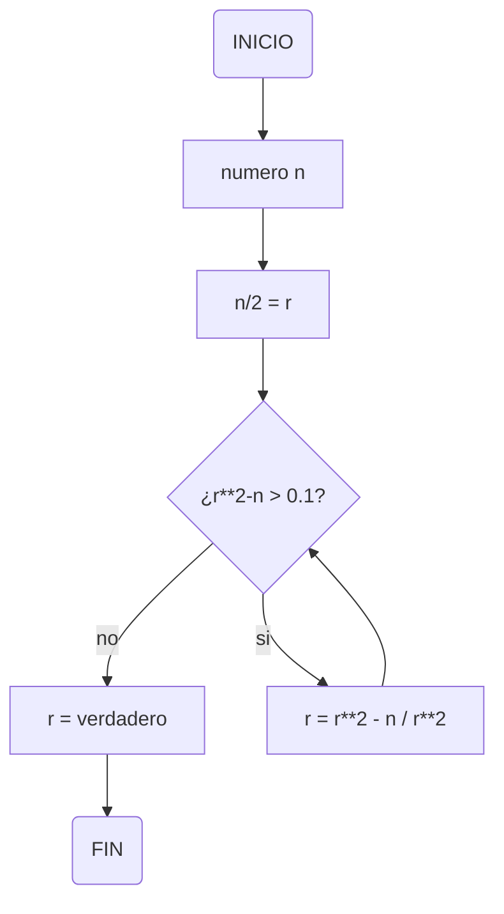

# Reto_3
En el siguiente repositorio se van a mostrar dos algoritmos a traves de pseudocodigo y de diagramas de flujo. El primer algoritmo es para hallar los numeros primos por debajo de un numero n y el segundo es para hallar la raiz cuadrada de un numero.
## Algoritmo-numeros primos
Pseudocodigo:

```
n : int
a : int
b : int
a = 2
Inicio
lista(2,...,n)
Mientras (a<n)hacer
  Mientras (b<n)hacer
    si b == es multiplo de a
    eliminar b de la lista
    b:=b+1
  Fin mientras
  a = a+1
  b = 3
Fin mientras
escribir(lista)
Fin
```
Diagrama de flujo

## Algoritmo-raices
Pseudocodigo: 
```
n : int
r : float
a : float
Inicio
  n / 2 = r
    si (r ** 2 - n) <= 0.1 entonces
      r = verdadero : z
      sino
      mientras (r ** 2 - n) > 0.1 hacer
         r = (r ** 2 + n) / r * 2
           si (r ** 2 - n) > 0.1 entonces
               r = falso
               sino
                 r = verdadero : a
                 si r = verdadero entonces
                 print ("la raiz cuadrada del numero es aproximadamente a")
               fin si
            fin si
      fin mientras
    fin si
FIN

```
Diagrama de flujo

